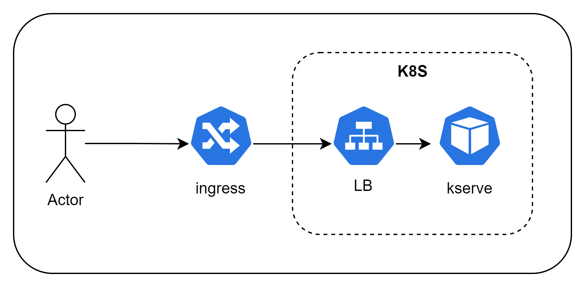
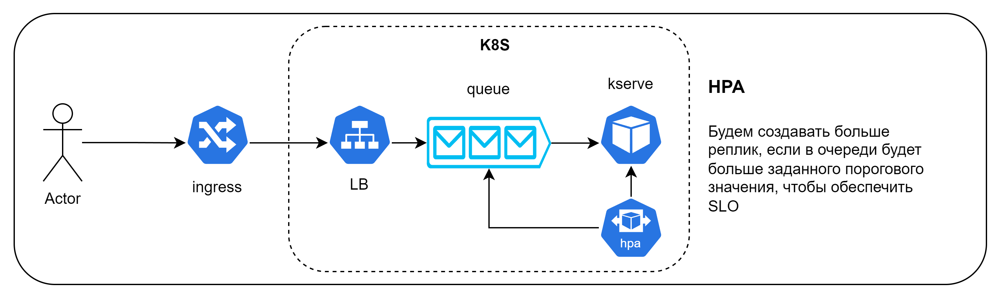
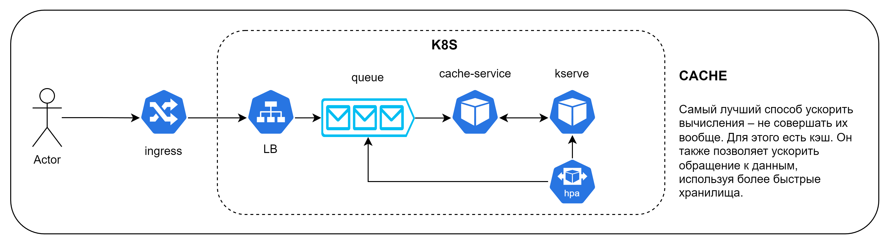

# DS-Cloud-test
Решение тестового задания на позицию Data Scientist в Cloud.ru

## Описание

Была обучена сеть для задачи Named Entity Recognition на датасете [NERUS](https://github.com/natasha/nerus). В качестве модели была выбрана модель ruBERT. От неё я взял токенизатор и энкодер, добавив к ним классификатор для токенов. Поверх обучения использовался *pytorch lightning*, а для логирования - *tensorboard*. В ходе решения тестового задания были реализованы сервисы kserve, jupyter, tensorboard.

___

## Ноутбуки

[Обучение модели](./notebooks/train.ipynb)

[Отправка запросов к kserve](./notebooks/kserve.ipynb)

---

## Архитектура решения

Сделал:


Лучшее решение:


Идеал:



## Запуск

### Docker (local method)

Перед запуском убедитесь, что в системе установлен `docker` и `docker-compose` коомандами:

```bash
sudo docker --version
sudo docker-compose --version
```

Далее проверьте, запущен ли демон `docker`
```bash
sudo docker ps
```

Тогда можно поднимать сервис
```bash
git clone https://github.com/t041lk8/DS-Cloud-test.git
sudo docker compose up
```

### K8S

```bash
kubectl apply -f ./manifests
```


## Тестирование

### Docker

#### Запрос 

```bash
curl -X POST "http://localhost:8080/v1/models/NERtagger:predict" \
    -H "Content-Type: application/json" \
    -d '{"text": "Глава компании Apple Тим Кук осенью представил новый телефон в штаб квартире Apple Inc в Купертино"}'
```

#### Ответ

`status_code: 200`

```json
{
    'entities': [
        {'text': 'глава', 'type': 'O', 'start': 0, 'end': 5},
        {'text': 'компании', 'type': 'O', 'start': 0, 'end': 14},
        {'text': 'apple', 'type': 'ORG', 'start': 6, 'end': 20},
        {'text': 'тим кук', 'type': 'PER', 'start': 18, 'end': 28},
        {'text': 'осенью', 'type': 'O', 'start': 27, 'end': 35},
        {'text': 'представил', 'type': 'O', 'start': 29, 'end': 46},
        {'text': 'новыи', 'type': 'O', 'start': 36, 'end': 52},
        {'text': 'телефон', 'type': 'O', 'start': 51, 'end': 60},
        {'text': 'в', 'type': 'O', 'start': 53, 'end': 62},
        {'text': 'штаб', 'type': 'O', 'start': 61, 'end': 67},
        {'text': 'квартире', 'type': 'O', 'start': 63, 'end': 76},
        {'text': 'apple inc', 'type': 'ORG', 'start': 68, 'end': 86},
        {'text': 'в', 'type': 'O', 'start': 83, 'end': 88},
        {'text': 'купертино', 'type': 'LOC', 'start': 87, 'end': 98}
    ],    
    'text': 'Глава компании Apple Тим Кук осенью представил новый телефон в штаб '   
         'квартире Apple Inc в Купертино'
}
```

#### Запрос 

```bash
curl -X POST "http://<your_any_node_external_ip>:30180/v1/models/NERtagger:predict" \
    -H "Content-Type: application/json" \
    -d '{"text": "Глава компании Apple Тим Кук осенью представил новый телефон в штаб квартире Apple Inc в Купертино"}'
```

### K8S

#### Ответ

`status_code: 200`

```json
```json
{
    'entities': [
        {'text': 'глава', 'type': 'O', 'start': 0, 'end': 5},
        {'text': 'компании', 'type': 'O', 'start': 0, 'end': 14},
        {'text': 'apple', 'type': 'ORG', 'start': 6, 'end': 20},
        {'text': 'тим кук', 'type': 'PER', 'start': 18, 'end': 28},
        {'text': 'осенью', 'type': 'O', 'start': 27, 'end': 35},
        {'text': 'представил', 'type': 'O', 'start': 29, 'end': 46},
        {'text': 'новыи', 'type': 'O', 'start': 36, 'end': 52},
        {'text': 'телефон', 'type': 'O', 'start': 51, 'end': 60},
        {'text': 'в', 'type': 'O', 'start': 53, 'end': 62},
        {'text': 'штаб', 'type': 'O', 'start': 61, 'end': 67},
        {'text': 'квартире', 'type': 'O', 'start': 63, 'end': 76},
        {'text': 'apple inc', 'type': 'ORG', 'start': 68, 'end': 86},
        {'text': 'в', 'type': 'O', 'start': 83, 'end': 88},
        {'text': 'купертино', 'type': 'LOC', 'start': 87, 'end': 98}
    ],    
    'text': 'Глава компании Apple Тим Кук осенью представил новый телефон в штаб '   
         'квартире Apple Inc в Купертино'
}
```
```